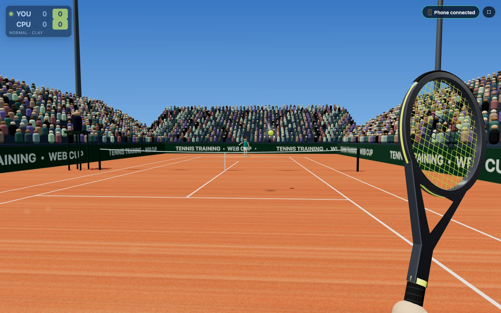

# 🎾 Tennis Training

**Tenis en primera persona en el navegador, donde tu celular es la raqueta.**
Controles de movimiento al estilo Wii Sports sin instalar nada: el juego corre
en tu computadora o TV y el giroscopio del celular manda la orientación de la
raqueta y tus swings por Wi-Fi en tiempo real.

### ▶️ [Juega ahora: doncebay.github.io/tennis-training](https://doncebay.github.io/tennis-training/)

Ábrelo en tu computadora, escanea el QR con tu celular y haz swing. No hay que instalar nada.

[English](README.md)



## Características

- **Tu celular es la raqueta.** Su orientación se convierte en un cuaternión y
  la raqueta 3D la copia, así que se mueve igual que tu mano.
- **Swings reales.** El golpe se detecta en el pico de velocidad angular del
  giroscopio (el momento de máxima velocidad de la raqueta), y la velocidad del
  swing decide la potencia.
- **Jugabilidad estilo Wii.** Tu jugador corre solo hacia la pelota; el momento
  del golpe decide la dirección: pronto = cruzado, tarde = paralelo.
- **Tres superficies con su propia física**: dura (rápida, bote medio), arcilla
  (lenta, bote alto, marcas y polvo) y césped (patina, bote bajo).
- **Cuatro diseños de raqueta** con marco extruido, garganta abierta, pintura
  brillante, encordado con logo y grip con cinta. Tu mano la sostiene en primera persona.
- **Reglas reales**: cuadros de saque, faltas y doble falta, let, fuera, red,
  deuce/ventaja, juegos y partido. Rival de la CPU con 3 dificultades.
- **Respuesta en el celular**: vibración (Android) y un "pock" en cada golpe,
  como el altavoz del Wiimote.
- **Inglés y español**, según el idioma del navegador (se puede cambiar en el menú).
- **Se puede jugar sin celular** con el mouse o el teclado.
- **Online o sin internet**: la versión publicada conecta el celular y la
  pantalla directamente (WebRTC); el servidor de Node funciona en tu red local
  incluso sin internet.
- Sin compilación ni frameworks: módulos ES + [three.js](https://threejs.org).

## Cómo empezar

### Jugar online

1. En la computadora abre **[doncebay.github.io/tennis-training](https://doncebay.github.io/tennis-training/)**.
2. Escanea el QR con tu celular (idealmente en la misma Wi-Fi que la computadora).
3. Toca **Conectar**, acepta el permiso de movimiento, apunta a la pantalla y toca **Calibrar**.
4. Sostén el celular como el mango de una raqueta y haz un **swing** para empezar.

### Correrlo tú mismo

Requisitos: [Node.js](https://nodejs.org) 18 o superior, y un celular en la misma red Wi-Fi que tu computadora.

```bash
git clone https://github.com/doncebay/tennis-training.git
cd tennis-training
npm install
npm start
```

1. En la computadora abre **http://localhost:8080**.
2. En el celular escanea el QR de la pantalla (o abre
   `https://<ip-de-tu-compu>:8443/c` y escribe el código de 4 letras).
3. La primera vez el celular mostrará un aviso de certificado: toca
   **Avanzado → Continuar**. El servidor usa un certificado local autofirmado
   porque iOS y Android sólo entregan el giroscopio a páginas seguras (HTTPS).
4. Toca **Conectar** y acepta el permiso de movimiento.
5. Apunta la parte de arriba del celular a la pantalla y toca **Calibrar**.
6. Sostén el celular como el mango de una raqueta y haz un **swing** para empezar.

¿Sin celular? Mueve el mouse y haz **clic** o pulsa **Espacio** para golpear
(Shift = golpe fuerte). **F** pantalla completa y **Esc** vuelve al menú.

| Cancha | Velocidad | Bote | Extras |
| --- | --- | --- | --- |
| Dura | Rápida | Medio | Cancha azul clásica |
| Arcilla | Lenta | Alto | Marcas de la pelota, polvo, muros verdes |
| Césped | Muy rápida | Bajo | Franjas de corte, fondo gastado |

## Configuración

| Variable | Por defecto | Uso |
| --- | --- | --- |
| `PORT` | `8080` | HTTP para la pantalla del juego |
| `HTTPS_PORT` | `8443` | HTTPS para el celular |
| `HOST_IP` | automática | IP que va en el QR si tienes varias interfaces de red |

Agrega `?lang=es` o `?lang=en` a cualquier URL para forzar el idioma.

## Problemas comunes

- **Online: el celular no encuentra la pantalla.** Revisa el código y pon ambos
  dispositivos en la misma Wi-Fi: no hay servidor intermedio, así que algunas
  redes no dejan conectar dos equipos directamente. Las Wi-Fi de hoteles,
  oficinas y cafés suelen bloquearlo; compartir internet desde el celular y
  conectar la computadora a esa red normalmente funciona.
- **Servidor local: el celular no conecta.** Revisa que esté en la misma Wi-Fi y que la IP del
  QR sea la de tu computadora; si no, usa `HOST_IP=192.168.x.x npm start`. En
  macOS permite las conexiones entrantes de Node si el firewall lo pregunta.
- **iPhone sin permiso de movimiento.** Ajustes → Safari → Movimiento y
  orientación, y recarga la página.
- **La raqueta apunta hacia otro lado.** Toca **Calibrar** otra vez apuntando a
  la pantalla (el rumbo del giroscopio deriva un poco con el tiempo).
- **El swing no se detecta o se detecta de más.** Cambia la sensibilidad en
  Ajustes del celular.

Los detalles técnicos están en el [README en inglés](README.md#how-it-works).

## Licencia

[MIT](LICENSE)
