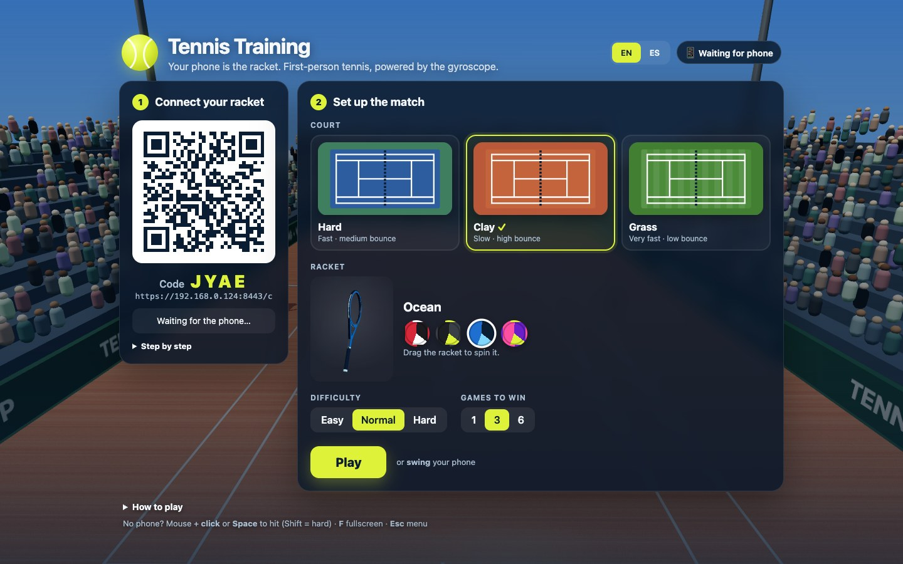
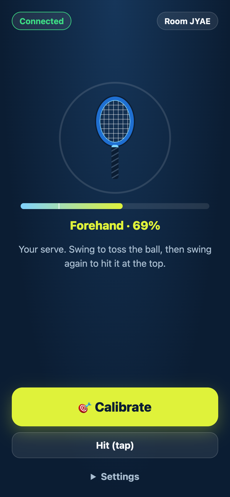
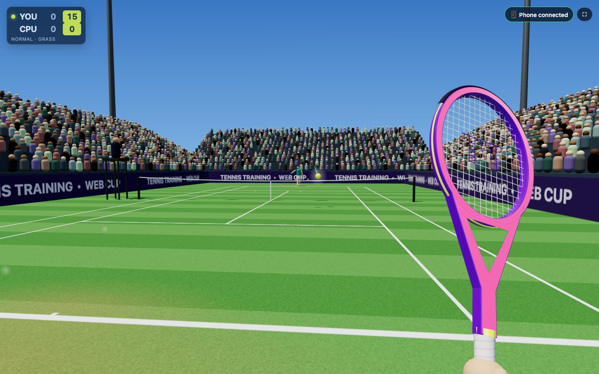

# 🎾 Tennis Training

**First-person tennis in the browser, where your phone is the racket.**
Wii Sports-style motion controls with nothing to install: the game runs on your
computer or TV, and your phone's gyroscope streams the racket's orientation and
your swings over Wi-Fi in real time.

[Español](README.es.md)


<table>
  <tr>
    <td></td>
    <td rowspan="2" width="28%"></td>
  </tr>
  <tr>
    <td></td>
  </tr>
</table>

## Features

- **Your phone is the racket.** Its orientation is turned into a quaternion and
  mirrored by the 3D racket, so it moves exactly like your hand.
- **Real swings.** A swing is detected at the peak of the gyroscope's angular
  velocity (the moment of maximum racket speed), and swing speed sets the power.
- **Wii-style gameplay.** Your player runs to the ball automatically; timing
  decides the direction: early = cross-court, late = down the line.
- **Three surfaces with their own physics**: hard (fast, medium bounce), clay
  (slow, high bounce, ball marks and dust) and grass (skids, low bounce).
- **Four racket designs** with an extruded frame, open throat, glossy paint,
  a stenciled string bed and a wrapped grip. Your first-person hand holds it.
- **Real tennis rules**: service boxes, faults and double faults, lets, outs,
  net, deuce/advantage, games and matches. A CPU opponent with 3 difficulty levels.
- **Feedback on the phone**: vibration (Android) and a "pock" on every hit,
  like the Wiimote's speaker.
- **English and Spanish**, detected from the browser (switchable in the menu).
- **Playable without a phone** using the mouse or keyboard.
- No build step, no frameworks: plain ES modules + [three.js](https://threejs.org).

## Quick start

Requirements: [Node.js](https://nodejs.org) 18 or newer, and a phone on the same Wi-Fi network as your computer.

```bash
git clone https://github.com/doncebay/tennis-training.git
cd tennis-training
npm install
npm start
```

1. On the computer, open **http://localhost:8080**.
2. On the phone, scan the QR code shown on screen (or open
   `https://<your-computer-ip>:8443/c` and type the 4-letter code).
3. The first time, the phone shows a certificate warning: tap
   **Advanced → Proceed**. The server uses a local self-signed certificate
   because iOS and Android only expose the gyroscope to secure (HTTPS) pages.
4. Tap **Connect** and allow motion access.
5. Point the top of the phone at the screen and tap **Calibrate**.
6. Hold the phone like a racket handle and **swing** to start.

No phone? Move the mouse and **click** or press **Space** to hit
(Shift = hard shot). **F** toggles fullscreen and **Esc** goes back to the menu.

### How to play

| Action | How |
| --- | --- |
| Serve | One swing tosses the ball, a second swing hits it. Best at the very top. |
| Groundstrokes | Swing when the ball reaches you. Early = cross-court, late = down the line. |
| Power | The faster the swing, the harder and deeper the shot (and the riskier). |
| Recalibrate | If the racket drifts, point at the screen and tap **Calibrate** again. |

| Court | Pace | Bounce | Extras |
| --- | --- | --- | --- |
| Hard | Fast | Medium | Classic blue court |
| Clay | Slow | High | Ball marks, dust, green walls |
| Grass | Very fast | Low | Mowing stripes, worn baselines |

## How it works

```
Phone (controller.html)                       Screen (index.html)
 deviceorientation ─► quaternion ──┐          ┌─► 3D racket mirrors the phone
 devicemotion (gyroscope)          │   WSS    │
   └─► angular-velocity peak ──────┼────────► ├─► swing → shot (timing + power)
                                   │ server.js│
 vibration + "pock" ◄──────────────┘          └── "hit", "point", "hint"
```

- **`server.js`** serves the app over HTTP (`:8080`) and HTTPS (`:8443`),
  generates a self-signed certificate for your LAN IP on first run, and pairs a
  screen with a phone in 4-letter rooms, relaying messages over WebSocket.
- **`public/js/controller.js`** converts `alpha/beta/gamma` into a quaternion
  (the phone is the racket handle), calibrates the heading toward the screen, and
  detects swings at the `rotationRate` peak.
- **`public/js/physics.js`** runs ball physics on a fixed 1/240 s step,
  predicts the contact point, and solves shots that clear the net. The same
  integrator drives both gameplay and prediction, so they always agree.
- **`public/js/match.js`** holds the rules, scoring, CPU opponent and the
  first-person camera.
- **`public/js/world.js`** builds the stadium, the three court surfaces, net,
  crowd and ball.
- **`public/js/characters.js`** has the rackets, your hand and forearm, and the
  Mii-style opponent.
- **`public/js/racketPreview.js`** is the 3D racket viewer in the menu.
- **`public/js/audio.js`** synthesizes every sound with the Web Audio API.
- **`public/js/i18n.js`** holds the English and Spanish strings.

## Configuration

| Variable | Default | Purpose |
| --- | --- | --- |
| `PORT` | `8080` | HTTP port for the game screen |
| `HTTPS_PORT` | `8443` | HTTPS port for the phone |
| `HOST_IP` | auto-detected | IP encoded in the QR code, if you have several network interfaces |

Add `?lang=en` or `?lang=es` to any URL to force a language.

## Troubleshooting

- **The phone can't connect.** Make sure it is on the same Wi-Fi and that the IP
  in the QR code is your computer's. If not, run `HOST_IP=192.168.x.x npm start`.
  On macOS, allow incoming connections for Node if the firewall asks.
- **iPhone: no motion permission.** Settings → Safari → Motion & Orientation
  Access, then reload the page.
- **The racket points the wrong way.** Tap **Calibrate** again while pointing
  at the screen. The gyroscope heading drifts a little over time.
- **Swings aren't detected, or trigger too easily.** Change the swing
  sensitivity in the phone's Settings panel.

## Contributing

Issues and pull requests are welcome. There is no build step: edit the files in
`public/` and reload. To add a language, add a block to `public/js/i18n.js` and
a button to the language switch in `public/index.html`.

## License

[MIT](LICENSE)
